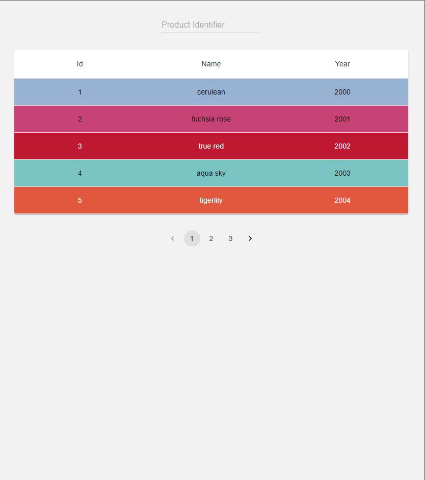
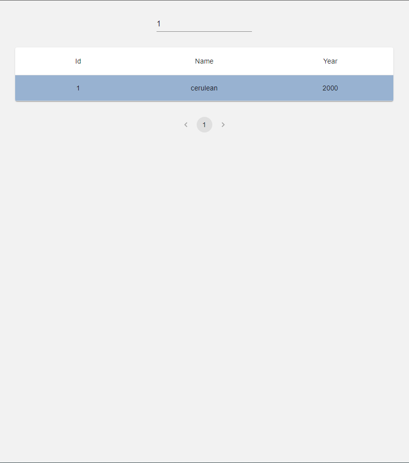
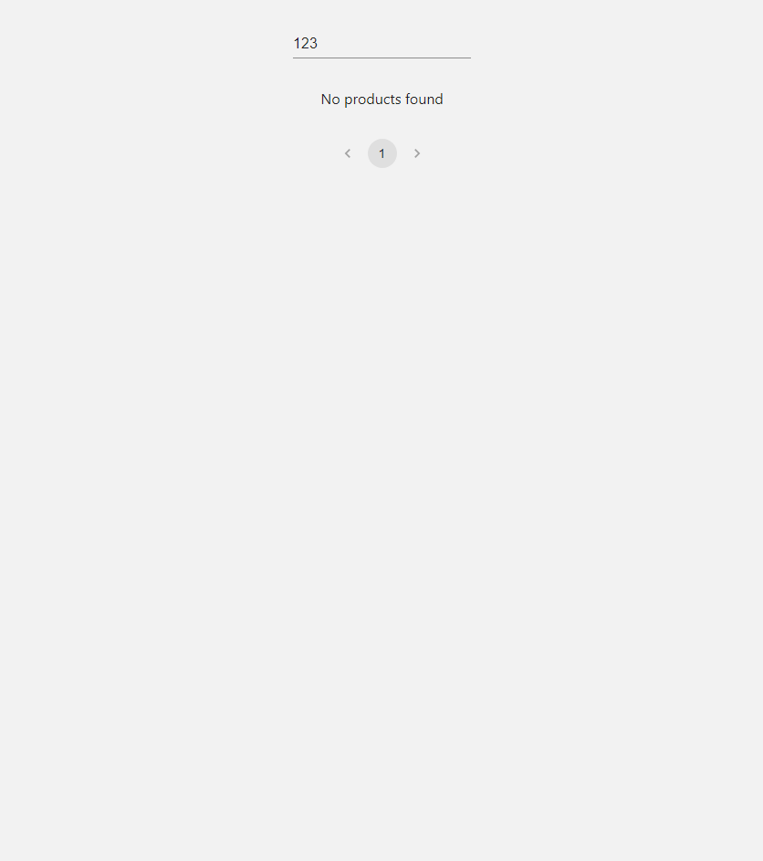

# RecruitmentTaskProducts

## Table of Contents

- [Description](#description)
- [Installation](#installation)
- [Usage](#usage)
- [Features](#features)

## Description

The goal of the task is to implement an SPA application with just one view. You should use
the below API endpoint to display the paginated list of products. At the top of the view, there
should be text input, which allows the user to filter results by id. The input should accept only
numbers, other signs should not even appear. Below this input user should see a table
displaying the following items’ properties: id, name, and year. Additionally, the background
colour of each row should be taken from the colour property. After clicking on a row a modal
should be displayed and should present all item’s data. The table should display 5 items per
page. Under the table, there should be a pagination component, which allows switching
between pages with “next” and “previous” arrows.
Please remember about handling situations when an API endpoint returns a 4XX or 5XX
error. In such a case the user should be informed about the error.
Apart from React and TypeScript, the technology stack totally ups to you, the same applies
to styling. As a result of the task, we expect a link to a repository on GitHub, GitLab, or
bitbucket and a link to the deployed version of your application. Your app should use at least
the node version 20.11.0 and should start after running npm install & npm start
commands.

**_Extra requirement (optional):_**  
Please reflect pagination and filtering in the address URL, so users can copy and share the
URL with each other (i.e. ?page=2&id=2).

Used libs:

- Tanstack React-Query
- Material UI
- Axios
- Jest
- React Testing Library
- Lodash

## Installation

To install this project you need:

- Node.js
- NPM

To install project dependencies run

```
npm install
```

To start project run

```
npm start
```

To run tests

```
npm test
```

To build app run

```
npm build
```

## Usage
| | |
| :---------------------------------------------------------------------------------------: | :--------------------------------------------------------------------------: |
|                      _1. Home page_                       |  _2. Loading product(s)_    |
| _3. Products filtered by id_  | _4. No products found info_  |
|    _5. Example error message_     |                                                                              |

## Features

- Fetching data from API endpoint
- Filter data by id
- Go through item pages using pagination
- Display detailed item data after clicking on its row
